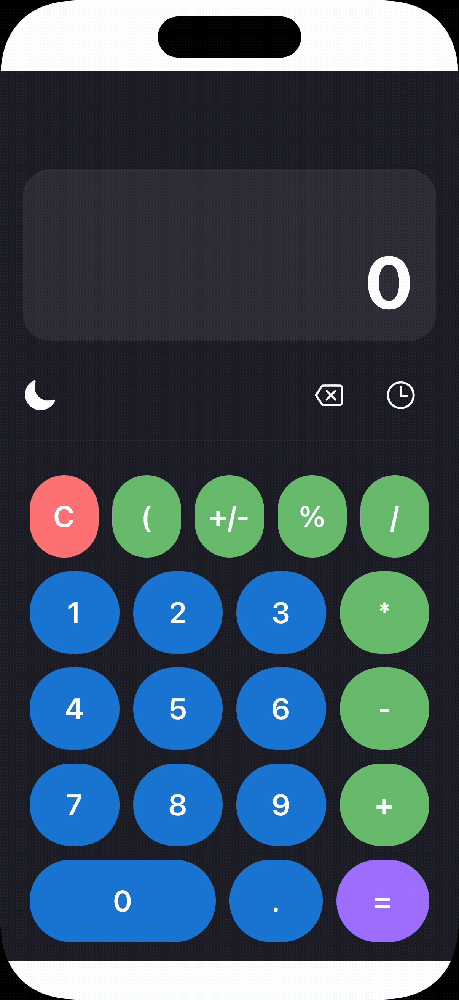

# Kalku

<div align="center">
  
</div>

**Kalku** es una calculadora multiplataforma moderna construida con **Expo** y **React Native**. Combina un diseño colorido y amigable con un motor aritmético completo: historial interactivo, soporte de paréntesis, límites de dígitos inteligentes y detección automática del tema del sistema. Todo listo para ejecutarse en **iOS**, **Android** y **Web** desde el mismo código base.


## Tabla de contenidos

- [Características principales](#características-principales)
- [Requisitos](#requisitos)
- [Estructura del proyecto](#estructura-del-proyecto)
- [Puesta en marcha](#puesta-en-marcha)


## Características principales

* **Motor avanzado:** operaciones encadenadas, porcentajes, inversión de signo y hasta 11 dígitos significativos con manejo de errores.
* **Historial inteligente:** guarda los últimos cálculos, permite reinsertarlos y eliminarlos individualmente.
* **Paréntesis dinámicos:** botón contextual que abre o cierra paréntesis según la expresión actual.
* **Temas adaptativos:** se sincroniza con el tema del sistema, con opción manual claro/oscuro.
* **Diseño responsive:** botones y tipografía ajustables a móviles, tablets y web; display mantiene altura constante.
* **Interfaz moderna:** logo integrado, colores personalizables y fondo que cubre toda el área respetando zonas seguras.


## Requisitos

* **Node.js:** v18 o superior
* **npm**
* **Expo CLI** (`npm install -g expo-cli`) — opcional si usas `npx`


## Estructura del proyecto

```
calc/
├── README.md
├── app.json
├── assets                                  # Recursos gráficos
│   └── images
│       └── logo.png
├── eslint.config.js
├── expo-env.d.ts
├── package-lock.json
├── package.json                            # Dependencias y scripts
├── src
│   ├── app                                 # Rutas Expo Router y pantalla principal
│   │   └── index.tsx
│   ├── components                          # Componentes reutilizables (botones, display, etc.)
│   │   ├── Buttons.tsx
│   │   ├── Display.tsx
│   │   ├── HistoryModal.tsx
│   │   └── Keypad.tsx
│   ├── context                             # Contextos como el de tema
│   │   └── themeContext.tsx
│   ├── styles                              # Paleta y estilos globales
│   │   ├── Colors.tsx
│   │   └── GlobalStyles.tsx
│   ├── types
│   │   └── calculator.ts
│   └── utils
│       └── calculator.ts
└── tsconfig.json                           # Configuración y alias de TypeScript
```


## Puesta en marcha

1. Install dependencies

```bash
  npm install
```

2. Navega al directorio del proyecto:

```bash
  cd calc
```

3. Start the app

```bash
  npx expo start
```

4. Desde la interfaz de **Expo**, abre la app en:

* **iOS:** presiona `i` para abrir el simulador.
* **Android:** presiona `a` o escanea el QR con **Expo Go**.
* **Web:** selecciona la opción `w`.
